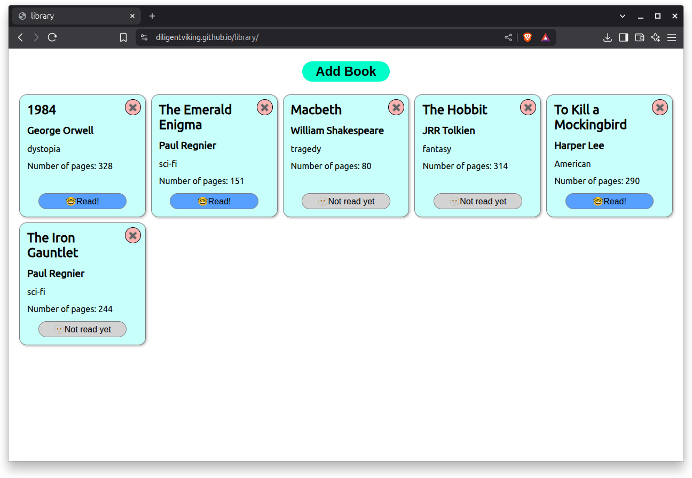
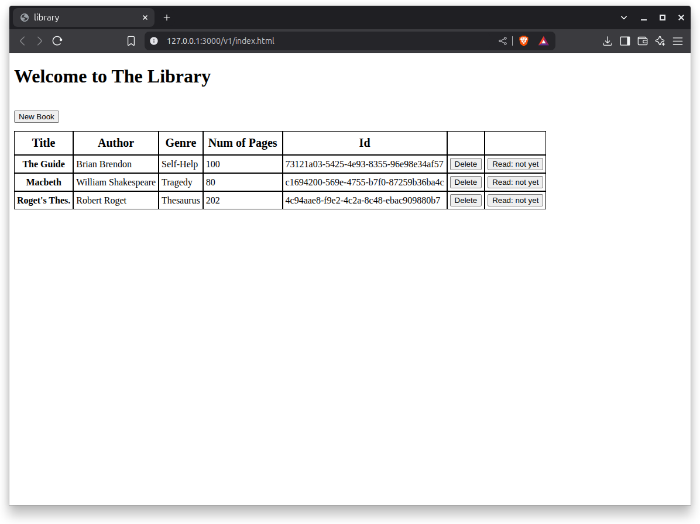

# The Limitless Library

An Odin project to make a small app that uses js constructor functions.

[Version 2](https://diligentviking.github.io/library/) (based off Alessandro Loiacoco)

[Version 1]() was a horrendously homely HTML table.

